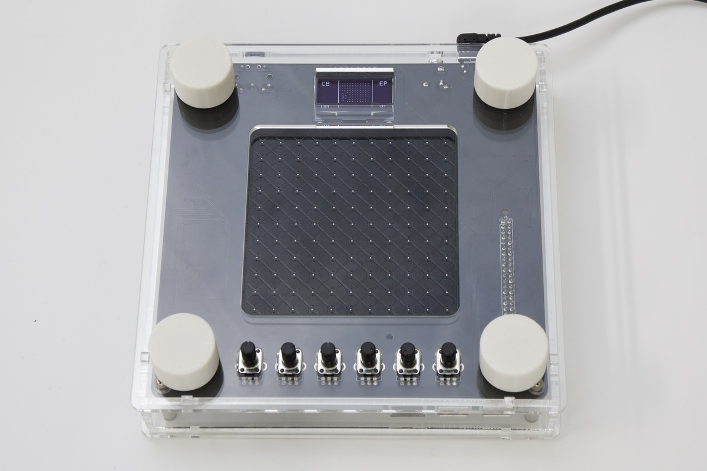

# FaBo NSynth Docs

## FaBo NSynth Docsについて

NSynthに関するドキュメントです。

## 修正依頼等

GithubのRepoに[Issues](https://github.com/FaBoPlatform/NSynthDocs/issues)をあげてください。

## サポート Discord

[https://discord.gg/StJ84Hb](https://discord.gg/StJ84Hb)

## 本ドキュメントでのセミナーの実施

## DonkeyCarの購入先(FaBo Store)
- NSynth Kit

## FaBo AI 教材
- [JetRacer Docs](https://faboplatform.github.io/JetracerDocs/)
- [JetBot Docs](https://faboplatform.github.io/JetbotDocs/)
- [DonkeyCar Docs](https://faboplatform.github.io/DonkeyDocs/)
- [EdgeAI Docs](https://faboplatform.github.io/EdgeAIDocs/)
- [JetBook Docs](https://faboplatform.github.io/JetBook/)
- [NSynth Docs](https://faboplatform.github.io/NSynthDocs/)

## FaBo教材
- [Arduino Docs](https://faboplatform.github.io/ArduinoDocs/)
- [RaspberryPi Docs](https://faboplatform.github.io/RaspberryPIDocs/)
- [IchigoJam Docs](https://faboplatform.github.io/IchigojamDocs/)
- [Circuit Docs](https://faboplatform.github.io/CircuitDocs/)
- [Denbun Docs](https://faboplatform.github.io/DenbunDocs/)
- [NRF Docs](https://faboplatform.github.io/NRFDocs/)
- [Android Things Docs](https://faboplatform.github.io/AndroidThingsDocs/)
- [DeviceWebAPI Docs](https://faboplatform.github.io/DeviceWebAPIDocs/)
